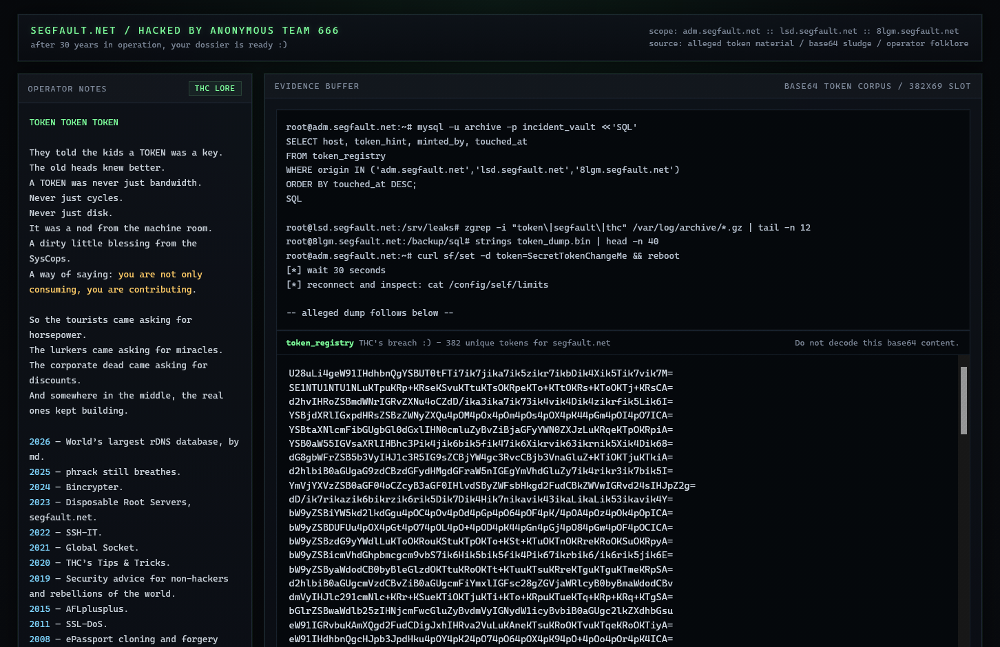
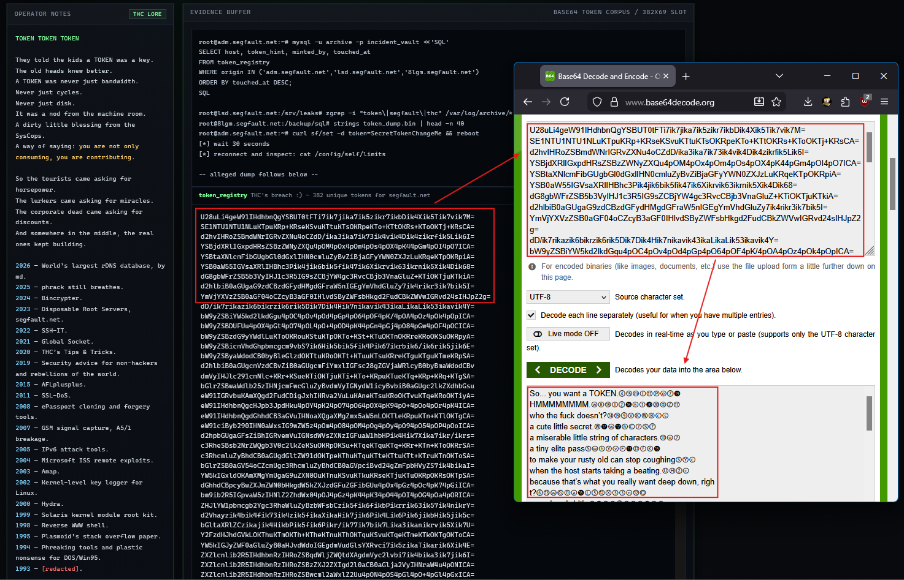

# segfault.net-breached-prank

sorry guys <3



(I wanted to hold off on this joke for longer, but I have other things to do.)

---

### How to identify?



---

### Decoded content
also, "tokens" xD

```
So... you want a TOKEN.
HMMMMMMMM.
who the fuck doesn’t?
a cute little secret.
a miserable little string of characters.
a tiny elite pass
to make your rusty old can stop coughing
when the host starts taking a beating.
because that’s what you really want deep down, righ
t?
more bandwidth.
more CPU.
more storage.
more breathing room.
more right to exist
when the rest of the rabble also decides to fight o
ver resources
like pigeons scrapping over crumbs on the sidewalk.
you don’t want “a token.”
you want priority.
you want that when shit is flying,
your root still opens
while half a dozen clueless animals
stay locked outside
staring at the timeout
like they’re staring at their own failure.
and let’s be honest:
that is perfectly understandable.
nobody joins segfault
dreaming of staying small,
weak,
limited,
castrated,
and breathing through a ventilator.
everybody wants the juiced-up version.
everybody wants the server with thicker skin.
everybody wants the privilege.
everybody wants the shortcut.
everybody wants to be treated like somebody
and not like just another inflatable doll with a sh
ell.
the difference
is that some people still have the decency
to do something useful before they open their mouth
.
because TOKEN does not fall from the sky.
it does not grow on trees.
it does not come out of a vending machine.
it is not some corporate trade-show freebie.
it is not an NFT.
it is not a coupon.
it is not cashback.
it is not one of those modern bullshit gimmicks
made to make idiots feel special.
TOKEN
is not for sale.
read that again,
slowly,
see if it finally enters your skull
wrapped in burnt ANSI dust:
TOKEN
IS
NOT
FOR
SALE.
you do not buy it.
you do not finance it.
you do not swipe a card for it.
you do not ask for a discount.
you do not ask “how much is it.”
this is not SaaS for limp-dick executives.
this is not some gourmet dashboard with dark mode a
nd rocket emojis.
you want a TOKEN?
then show up.
show your work.
prove you are not just another parasite
consuming resources,
taking up space,
and typing bullshit in chat
as if mere presence counted as contribution.
want to get the SysCops’ attention?
great.
start by not being dead weight.
join the discussions.
yes, join them.
don’t just lurk in the channel
like a basement rat
waiting for privilege to drop from the ceiling.
talk.
bring ideas.
bring criticism.
bring decent questions.
bring useful observations.
bring anything for fuck’s sake
other than
“can someone help me”
or
“how do I get a token fast.”
help the Admins.
help the SysCops.
moderate the mess.
hold the line when the zoo opens up.
show that you know the difference between
community
and an ego parking lot.
find a bug.
but find a real bug.
don’t come in here with a fart wrapped in markdown
thinking you found the flaw of the century
because a banner responded differently
or because you saw a crooked header.
a meaningful bug.
a bug that matters.
a bug that improves the place.
a bug that prevents headaches.
a bug that shows you actually looked
before barking.
projects that help the community?
yes.
that gets attention.
projects that are new and exciting?
yes.
that gets attention too.
hacktivism?
security research?
useful shit?
living shit?
something that breathes intent and substance?
now you’re finally speaking the right language.
“save the world” is on the list?
it is.
are they going to demand literal proof of that?
probably not.
but if you can at least manage
not to make it worse,
that’s already a better start
than a lot of motherfuckers who show up
wanting premium resources
just to run polished uselessness.
and let’s make one thing crystal fucking clear,
in giant mental uppercase,
to avoid the usual baboon interpretation:
SEGFAULT
IS
NOT
FOR
WAREZ.
not for bug bounty.
not for bots.
not for mining.
not for hosting little game servers.
not a playground for bored script kiddies.
not an incubator for automated trash.
not a warehouse of digital junk
so you can monetize latency.
if your “big idea”
is to suck on community infrastructure
to run opportunistic garbage,
save everyone’s time
and disappear with dignity.
or without dignity.
either way.
doesn’t matter.
want to ask for a TOKEN the right way?
make contact.
explain your project.
no detours.
no LinkedIn pitch.
no visionary founder babble.
no “ecosystem.”
no “disruption.”
no “scalable solution.”
no vocabulary that makes people deserve a beating w
ith a network cable.
show what it is.
what it does.
why it exists.
why anyone should care.
why you are not just another infra leech
wearing pseudo-hacker aesthetics bought from a temp
late.
and send what was requested:
echo "$SF_HOSTNAME $SF_LID $SF_FQDN"
don’t invent shit.
don’t dress it up.
don’t send a cropped screenshot.
don’t send poetic text.
don’t send excuses.
send the fucking output
and ask for the TOKEN.
simple.
if the SysCops like your path,
if the community looks at your project
and thinks “okay, this isn’t trash,”
if your name doesn’t stink of cheap opportunism,
maybe you get noticed.
maybe.
because this is the point
that people spoiled by the modern internet
have a hard time accepting:
you are not entitled to a damn thing.
repeating:
you.
are.
not.
entitled.
TOKEN is recognition,
not obligation.
it is a gift,
not a contract.
it is a consequence,
not a signup form.
it is a sign that somebody looked at your trail
and concluded you add more
than you consume.
and if you think you’re very brave,
very confident,
very indispensable,
you can always bother a SysCop in private.
you were warned.
what does that mean?
it means it might work.
or it might make you look like
just another desperate nuisance
with zero sense of context,
zero timing,
and zero shame.
judge carefully.
because there is a thin line
between “persistent”
and “annoying as fuck.”
and a lot of people cross that line
running,
naked,
and screaming.
got the TOKEN?
congratulations.
now stop shaking
and use the damn thing properly.
log into your root server
and run:
curl sf/set -d token=SecretTokenChangeMe && reboot
then wait 30 seconds.
thirty.
not twenty.
not two.
not “I think it’s done.”
thirty seconds,
you impatient animal.
then come back,
log in again,
and check:
cat /config/self/limits
and there you go.
more resources.
more headroom.
more muscle.
less whining.
but don’t forget:
TOKEN does not turn shit into gold.
if your project is still useless,
it will just be useless
with more bandwidth,
more CPU,
more disk,
and priority access to its own embarrassment.
resources amplify competence,
but they also amplify stupidity.
give too much CPU to an idiot
and he just compiles disaster faster.
give too much storage to a parasite
and he just hoards trash at a larger scale.
give login priority to a useless asshole
and he just gets in first
to do stupid shit in greater comfort.
so don’t treat TOKEN
like an ego medal.
treat it like a tool.
treat it like a vote of confidence.
treat it like something you need to keep deserving
even after you get it.
and now the part that always pisses off
the little suits,
the slick opportunists,
the corporate freeloaders,
and the merchants of community misery:
if you’re corporate,
or using the service commercially,
or squeezing any financial benefit,
favor,
perk,
advantage,
favoritism,
paid networking,
or any other kind of gain
out of the infrastructure,
then open your wallet
and donate real money.
big dough.
not pocket change.
not symbolic gestures.
not sentimental crumbs
to ease your leech conscience.
BIG DOUGH.
because community does not exist
to subsidize your revenue.
infrastructure does not sustain itself on applause.
bandwidth is not born from good intentions.
hardware is not paid for with branding.
and no SysCop wakes up smiling
to bankroll someone else’s commercial operation
in the name of “culture.”
you want profit?
contribute heavily.
you want to use community infrastructure
as a business trampoline
while still posing as some underground rebel?
go fuck yourself in the center of the cluster.
that’s the spirit.
no foam.
no cute onboarding.
no startup copywriting.
no premium-support smile.
you want a TOKEN?
great.
earn it,
or stay out there on the outside,
staring at the current limits
and fantasizing about an upgrade
like someone dreaming of root access
in a life where he can barely access
his own shame.
show up in the channel.
show the project.
participate.
help.
build.
discover something meaningful.
bring fire,
not smoke.
and maybe,
just maybe,
the SysCops will look at your digital face
and decide:
“that one isn’t just another clown.
give him a TOKEN.”
until then,
less posing,
more substance.
less privilege begging,
more technical trail.
less empty talk,
more reason.
TOKEN is not for the people who want it.
TOKEN is for the people who make others think
“yeah, that motherfucker deserves it.”
------------------------------------------------
access https://mail.thc.org and claim your 
  @segfault.net exclusive email address.
access https://mail.thc.org and claim your
  @free.team-teso.net exclusive email address.
access https://mail.thc.org and claim your
  @smokes.thc.org exclusive email address.
access https://mail.thc.org and claim your
  @reads.phrack.org exclusive email address.
------------------------------------------------
virtual kisses from extencil@segfault.net
virtual kisses from extencil@smokes.thc.org
virtual kisses from extencil@proton.thc.org
virtual kisses from extencil@haltman.io
virtual kisses from members@proton.thc.org
------------------------------------------------
VERY BIG SHOUTZ TO SKYPER
shoutz d1g
shoutz messede
shoutz clonazepunk
shoutz matheus biagi (cria um nick logo caraio)
shoutz to gabriel akbar (rest in peace bro)
!!GREETS TO THE REST OF THC!!
------------------------------------------------
EOF
```